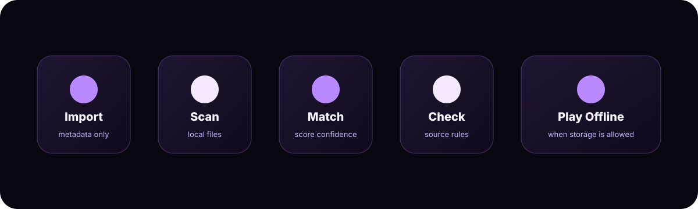

<div align="center">
  

  # Hoovi Music

  **A personal music vault for playlists, local files, safe matching, and offline listening.**

  Import playlist metadata. Match your music safely. Keep allowed tracks playable offline.

  <br />

  <a href="docs/start-here.md"><strong>Start here</strong></a> ·
  <a href="docs/product/experience-map.md"><strong>Experience map</strong></a> ·
  <a href="docs/engine/safe-resolver.md"><strong>Safe resolver</strong></a> ·
  <a href="docs/brand/voice.md"><strong>Brand voice</strong></a>
</div>

---

## What Hoovi Music is

Hoovi Music is a library-first music app.

The product imports playlist metadata, scans a user's own files, matches tracks against permitted sources, and gives the user a clean offline player for music they own or are allowed to store.

```txt
playlist metadata  →  local library  →  safe matching  →  offline playback
```

The app can feel familiar to people who understand streaming players, but the product position is different:

> Hoovi Music keeps your music library organized, portable, and honest.

## Product flow



1. **Import** playlist metadata from supported services or files.
2. **Scan** local music folders and user-owned files.
3. **Match** titles, artists, albums, durations, ISRCs, and fingerprints where available.
4. **Check** whether the source allows playback or offline storage.
5. **Play** matched tracks locally.
6. **Save offline** only when the source permits it.

## Main screens

| Screen | Job |
| --- | --- |
| Home | Show the user's library state, recent imports, and player status. |
| Library | Organize tracks, albums, artists, and local files. |
| Playlists | Preserve playlist structure and track order. |
| Imports | Connect metadata sources and review imported playlists. |
| Matches | Show matched, uncertain, blocked, and offline-ready tracks. |
| Offline | Show tracks that can be played without a connection. |
| Downloads | Manage permitted offline saves only. |
| Settings | Control folders, source permissions, matching confidence, and playback. |

## Architecture

```txt
Hoovi Music App
├─ UI shell
│  ├─ Home
│  ├─ Library
│  ├─ Playlists
│  ├─ Imports
│  ├─ Matches
│  └─ Player
│
├─ Metadata layer
│  ├─ playlist importers
│  ├─ local file scanner
│  └─ metadata normalizer
│
├─ Resolver layer
│  ├─ local file resolver
│  ├─ permitted source resolver
│  ├─ confidence scoring
│  └─ rejection reasons
│
├─ Source policy gate
│  ├─ playback permission
│  ├─ offline permission
│  └─ source proof
│
└─ Offline cache
   ├─ audio file
   ├─ artwork
   ├─ lyrics
   ├─ source metadata
   └─ checksum
```

## Performance rule

The 200ms target applies to local actions:

- opening an already imported playlist
- showing cached artwork
- searching the local index
- starting an offline track
- moving through the local queue

First-time source matching, fingerprinting, and permission checks are background jobs. The UI should show progress instead of pretending those actions are instant.

## Source policy

Allowed sources:

- user-owned local files
- user-uploaded files
- licensed catalog files
- public-domain files
- Creative Commons files that allow offline storage
- direct artist sources that explicitly allow storage

Blocked sources:

- protected platform audio
- restricted streams
- sources that forbid offline storage
- uncertain or unverified sources
- misleading download behavior disguised as matching

## Documentation map

| Doc | Purpose |
| --- | --- |
| [`docs/start-here.md`](docs/start-here.md) | Product overview and build direction. |
| [`docs/product/experience-map.md`](docs/product/experience-map.md) | User-facing app journey and screens. |
| [`docs/product/offline-rules.md`](docs/product/offline-rules.md) | What offline means inside Hoovi Music. |
| [`docs/engine/safe-resolver.md`](docs/engine/safe-resolver.md) | Matching, confidence scoring, and source checks. |
| [`docs/brand/voice.md`](docs/brand/voice.md) | Copy rules for every user-facing surface. |
| [`docs/brand/stickers.md`](docs/brand/stickers.md) | Illustration and sticker system. |
| [`docs/validation.md`](docs/validation.md) | Build and QA checklist before release. |

## Development status

This repository is being rebranded into Hoovi Music while preserving the original engine until each change can be verified. Documentation and user-facing product language are being moved first because the product must be legally and emotionally clear before deeper engine changes.

## License

This project inherits the upstream license obligations of the codebase it was forked from. Keep original notices intact where legally required.
